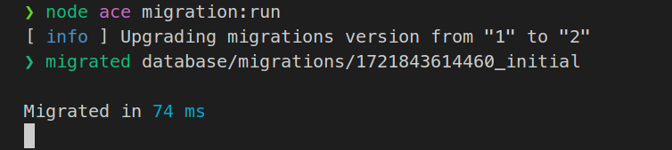

# Migration Process Freezing with Adonis V6 Using Replicas

This project demonstrates an issue when using database replicas with Adonis V6.

## Steps to Reproduce

1. **Create the `.env` file:**
   ```bash
   cp .env.example .env
   ```

2. **Create and start the PostgreSQL database:**
   ```bash
   docker compose up -d
   ```

3. **Run the migrations:**
   ```bash
   node ace migration:run
   ```

The migrations will execute correctly, but the process will not terminate, remaining in a frozen state:


---

**Node Version:** 20.15.1  
**Ubuntu Version:** 24.04

